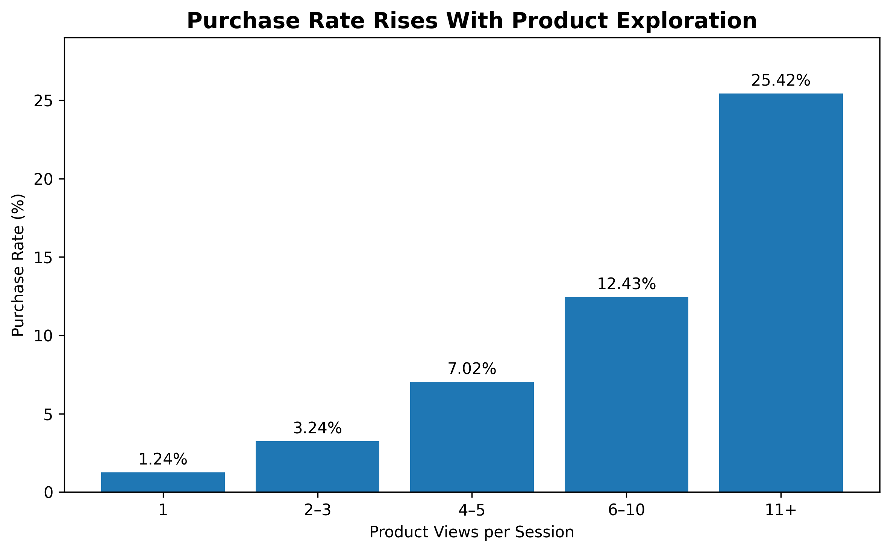
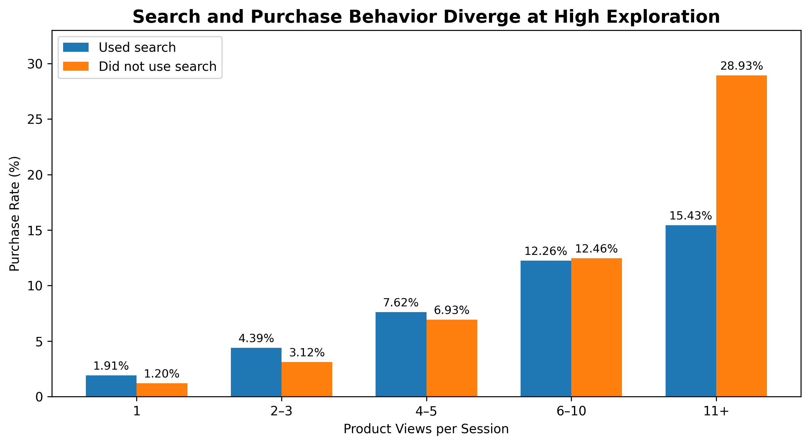
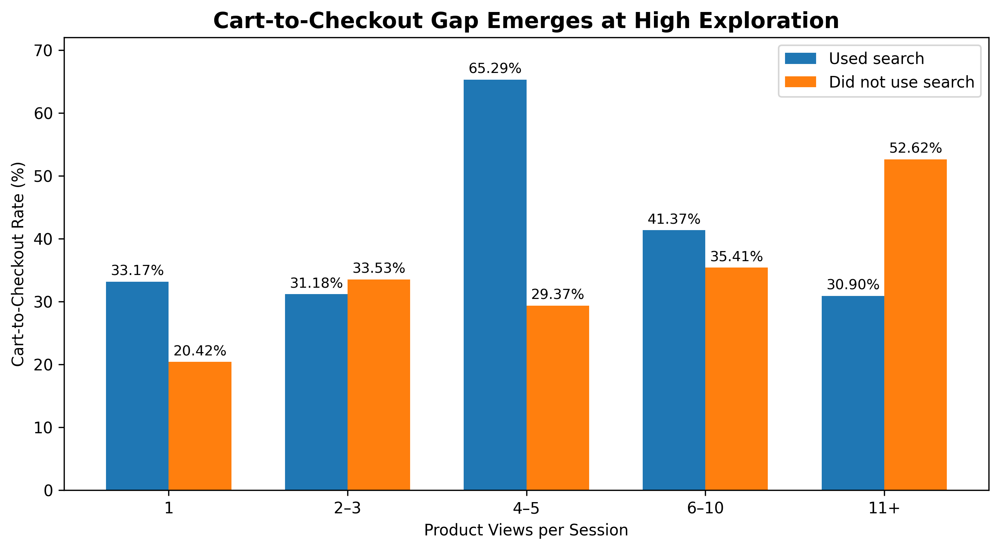

# GA4 Ecommerce Conversion Analysis

## Overview

This project investigates purchase conversion behavior using Google Analytics 4 ecommerce event data.

The analysis started with a broad business question:

> **What behaviors distinguish purchasing sessions from non-purchasing sessions, and where should an ecommerce team investigate opportunities to improve conversion?**

Rather than assuming where users were dropping off, I used SQL in BigQuery to explore the customer journey, test potential explanations, segment user behavior, and validate findings before making a recommendation.

## Business Problem

An ecommerce team wants to improve purchase conversion but needs to understand where meaningful differences in user behavior occur throughout the shopping journey.

I focused the analysis on three questions:

1. How do users progress through the ecommerce journey?
2. Which behaviors are associated with successful purchases?
3. Where does the data suggest the team should investigate opportunities to improve conversion?

## Dataset

**Source:** Google Analytics 4 sample ecommerce dataset  
**Platform:** Google BigQuery

The dataset contains event-level ecommerce activity, including:

- product views
- search activity
- add-to-cart events
- checkout initiation
- shipping and payment events
- purchases

Because the sample dataset is obfuscated and contains known consistency limitations, findings are treated as behavioral signals rather than definitive evidence of product causality.

## Tools

- SQL
- Google BigQuery
- Python
- Pandas
- Matplotlib
- Google Colab

## Analysis Approach

The investigation progressed from broad funnel analysis toward increasingly specific behavioral segmentation.

### 1. Understand the event data

I first explored the available GA4 events to understand how shopping behavior was represented.

Initial event counts showed substantial activity across product views, cart events, checkout events, and purchases. However, event counts alone could not establish how individual users progressed through the journey.

### 2. Build and validate the funnel

I moved from event counts to user-level analysis and then to session-level chronological analysis.

This distinction mattered because simply observing two events from the same user does not prove that they occurred:

- in the same session
- in the expected order
- as part of the same shopping journey

I therefore used `ga_session_id` and `event_timestamp` to create stricter definitions of funnel progression.

### 3. Test device and acquisition explanations

I compared funnel behavior across device categories and acquisition sources.

Desktop and mobile sessions showed very similar progression patterns, so device did not provide a compelling explanation.

Acquisition sources showed some variation, but no clear and interpretable pattern strong enough to explain the broader conversion behavior.

This shifted the investigation from **who the users were** toward **what they did during their sessions**.

## Finding 1: Purchase Rate Increased With Product Exploration

Sessions were grouped by the number of product views they contained.



Purchase rate increased consistently with exploration depth:

| Product views | Purchase rate |
|---|---:|
| 1 | 1.24% |
| 2–3 | 3.24% |
| 4–5 | 7.02% |
| 6–10 | 12.43% |
| 11+ | 25.42% |

Sessions with 11+ product views had a **25.42% purchase rate**, compared with **1.24%** among sessions with a single product view.

This establishes a strong association between product exploration and purchase behavior, but it does not establish that additional product views cause purchases.

## Finding 2: The Relationship Between Search and Purchase Depends on Exploration Depth

At the aggregate level, sessions using site search appeared to perform better:

- Search sessions: **8.20% purchase rate**
- Non-search sessions: **5.86% purchase rate**

However, search sessions also viewed substantially more products on average.

Because product exploration was already associated with purchase, I compared search and non-search sessions at similar exploration levels.



The relationship changed as exploration increased.

At lower exploration levels, search sessions generally had similar or higher purchase rates. At 6–10 product views, the groups were nearly identical.

At **11+ product views**, however, the relationship reversed:

- Used search: **15.43% purchase rate**
- Did not use search: **28.93% purchase rate**

This suggested that highly exploratory search sessions represented a distinct behavioral segment worth investigating.

## Finding 3: High-Exploration Search Sessions Reached Cart but Progressed to Checkout Less Often

I next examined sessions with 11+ product views.

Search users in this segment were highly engaged:

- Search sessions averaged **37.95 product views**
- Non-search sessions averaged **21.30 product views**

Both groups also reached cart at approximately the same rate:

- Search: **52.67%**
- No search: **51.09%**

The purchase difference therefore did not appear to originate simply from failure to reach cart.

I followed these sessions further into the journey and validated cart-to-checkout progression using event timestamps.



Among high-exploration sessions that reached cart:

- Search: **30.90%** progressed from cart to checkout
- No search: **52.62%** progressed from cart to checkout

That is a **21.72 percentage-point difference**.

Importantly, this pattern was not consistent across every exploration level. The negative difference was concentrated among the highest-exploration segment, so the analysis does **not** support the broader conclusion that search generally reduces checkout progression.

## Measurement Validation

An important part of the analysis was correcting an initially misleading result.

A first comparison based on events occurring within the same session appeared to suggest a large difference in checkout-to-purchase completion.

However, co-occurrence does not establish sequence.

I re-ran the analysis using event timestamps to verify that checkout occurred after cart activity. Once chronology was enforced, the apparent downstream checkout-completion problem largely disappeared.

The meaningful difference instead appeared earlier, between **cart and checkout**.

This validation changed the interpretation of the data and prevented a recommendation based on an incorrectly defined funnel.

## Key Insight

> **Highly exploratory search users show strong shopping engagement but are less likely to progress from cart to checkout than comparable non-search sessions.**

The evidence does not establish that search causes lower conversion. Instead, it identifies a specific behavioral segment where further investigation could be valuable.

## Recommendation

Investigate the experience of **high-exploration search users around the transition from cart to checkout** before prescribing a redesign.

Useful follow-up analysis could examine:

- search queries and search-result relevance
- products repeatedly viewed
- repeated searches
- cart additions and removals
- product comparison behavior
- navigation immediately before and after cart activity

Quantitative analysis should be paired with usability research or session-level behavioral research to understand **why** these users browse extensively, reach cart, but initiate checkout less often.

If a specific friction point is identified, the team could then test an intervention and measure whether it improves cart-to-checkout progression without reducing downstream purchase completion.

## Limitations

- The GA4 sample ecommerce dataset is obfuscated and has known consistency limitations.
- Behavioral associations do not establish causation.
- The analysis focuses on observed event behavior and cannot explain user intent.
- Session and funnel definitions influence reported conversion rates.
- The primary finding is concentrated within a specific high-exploration segment and should not be generalized to all search users.

## Repository Structure

```text
.
├── README.md
├── sql/
│   ├── 01_event_exploration.sql
│   ├── 02_user_funnel.sql
│   ├── 03_session_funnel.sql
│   ├── 04_device_analysis.sql
│   ├── 05_acquisition_analysis.sql
│   ├── 06_product_exploration.sql
│   ├── 07_search_behavior.sql
│   ├── 08_search_by_exploration.sql
│   ├── 09_high_exploration_cart_behavior.sql
│   ├── 10_cart_checkout_validation.sql
│   └── 11_cart_checkout_by_exploration.sql
├── notebooks/
│   └── ga4_ecommerce_visualizations.ipynb
└── visuals/
    ├── purchase-rate-by-product-views.png
    ├── purchase-rate-by-search-and-exploration.png
    └── cart-to-checkout-by-search-and-exploration.png
```

## Skills Demonstrated

**SQL:** querying nested GA4 data, CTEs, conditional aggregation, session construction, segmentation, timestamp-based sequence validation, `SAFE_DIVIDE`

**Analytics:** funnel analysis, behavioral segmentation, conversion analysis, confounding awareness, metric validation, hypothesis development

**Python:** Pandas DataFrames and Matplotlib data visualization

**Business analysis:** translating an ambiguous conversion problem into measurable questions, testing competing explanations, identifying a focused opportunity, and defining next steps without overstating causality
